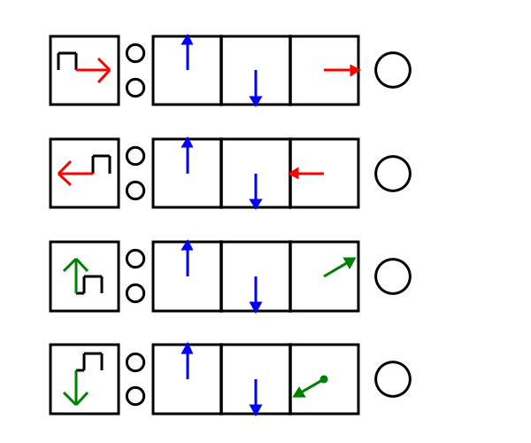
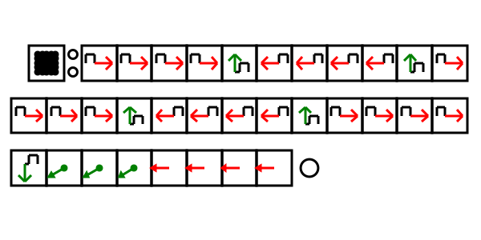
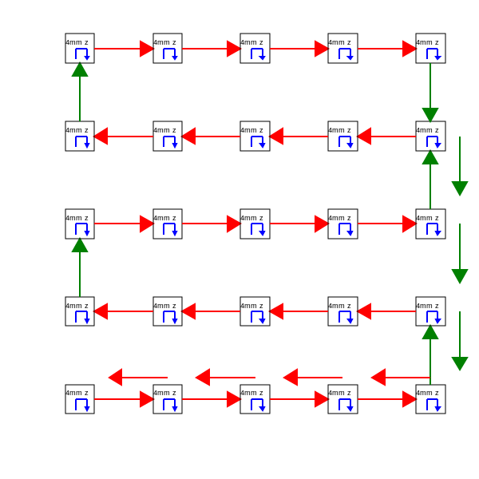

### [../](../)

# trashScope GEOMETRON Trajectory

We move the stage in an array on a 4 mm grid in the x,y and z axes using the Trash Robot DVD stage system.  Geometric actions are programmed with the Geometron purely geometric programming language.  The trajectory is an JSON array which can then be imported into the Python program which fits the data in the video of the microscope to create a 3d point cloud and import it into Blender.

### [data/trajectory.txt](data/trajectory.txt)